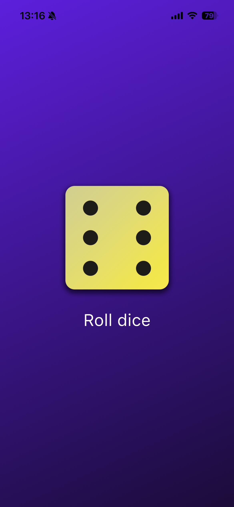

# 🎲 DiceRoll - Flutter App

A simple Flutter application that simulates rolling a dice.

The app displays a dice image and generates a random number each time the user presses the **Roll Dice** button.

This project was created as a beginner Flutter exercise to practice widgets, state management, and user interaction.

---

## ✨ Features

- Clean minimal UI
- Dice rolling animation logic using random numbers
- Image changes dynamically based on dice result
- StatefulWidget usage
- Beginner-friendly Flutter project

---

## 📸 Screenshot

  

